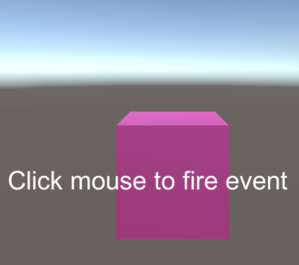
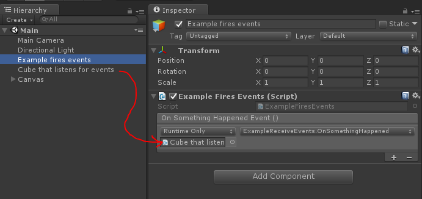

# unity-events-example

Demonstrates using UnityEvents to hook up events in the inspector and keep code linkage clean:

```c#
using UnityEngine.Events;

public class ExampleFiresEvents : MonoBehaviour {

	public UnityEvent onSomethingHappenedEvent;

	void Update () {

		if (Input.GetButtonDown ("Fire1")) {
			onSomethingHappenedEvent.Invoke ();
		}
	}
}
```

And in the inspector:


